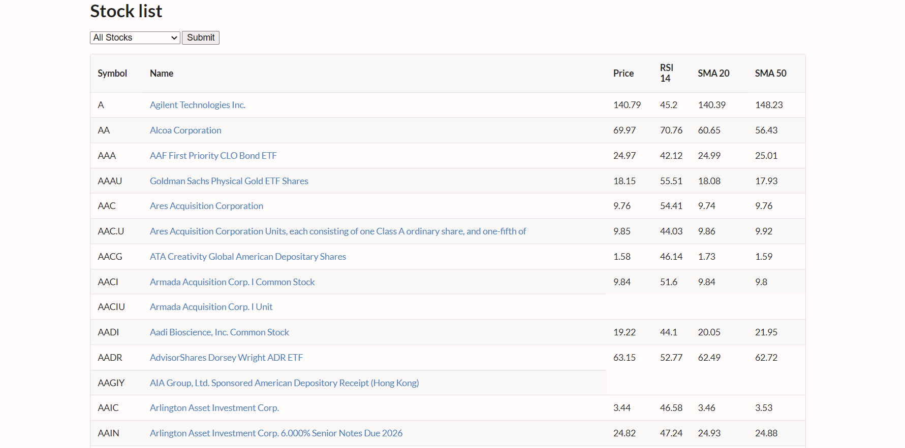
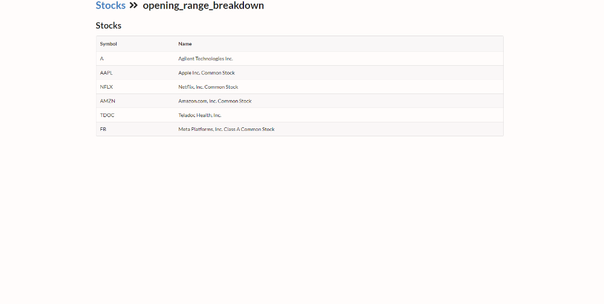
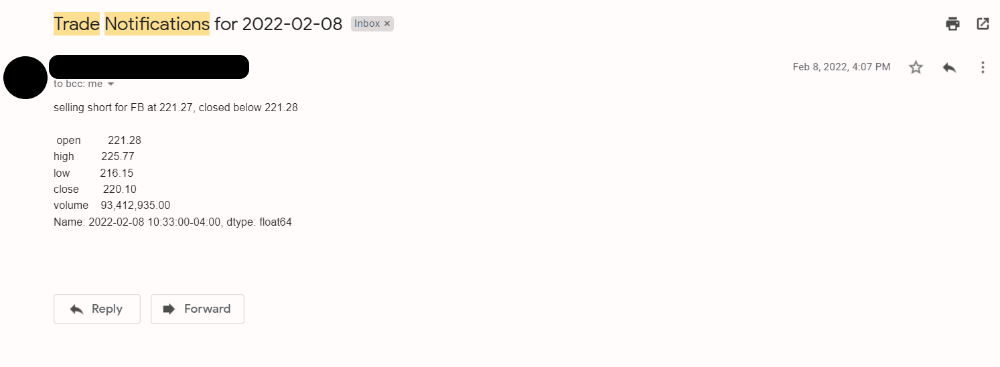

# Automatic Stock Trading App

This project is an automated Stock Trader.
It utilizes the opening range breakout and breakdown strategy.
The app centers around the Alpaca Trade API, a brokerage API which allows users to buy and sell stocks.
With the power of job scheduling, this project allows for a portfolio of stocks to be managed automatically while staying updated on any changes with automated emails.

Technology used: SQL, SQLite, Python, FAST API, NumPy, smtplib

## Screenshots

Default/Index Page

Individual Stock Page

Stock Strategy page

Trading Notification for when a stock is shorted

## Features

- Dynamic website which actively shows the user which strategy is being applied to what stock
- Totally automated portfolio management
- Opening breakout and breakdown strategy
- Access to stocks from the NASDAQ and NYSE

## Lessons Learned

- How to work with a REST API
- Managing and altering databases using SQL
- How to utilize a brokerage API

## Feedback

If you have any feedback, please reach out to us at yusufnissar8@gmail.com
